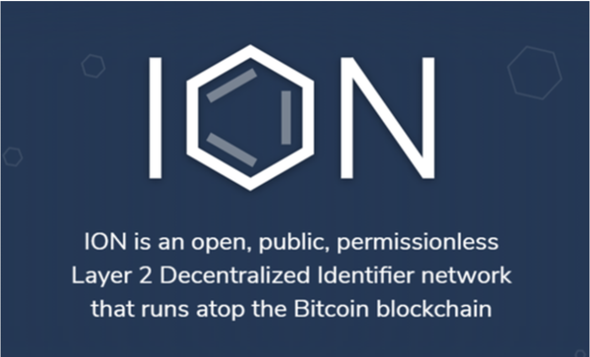
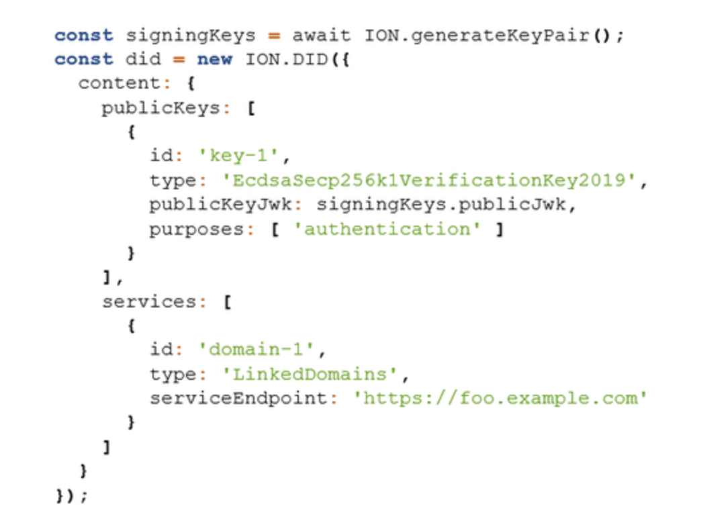
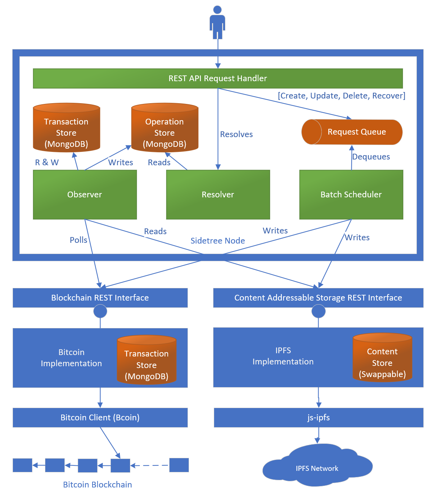

# Q&A about ION
**The questions are mixed basic and detailed, the answers are mostly directed towards generally interested people and newbies.**

Why should you read or step through the Q&A? To get a different angle to the same topic: ION.


This document relies on a [Glossary](./Glossary.md) file that has:
- a alphabethically ordered list of **abbreviations**
- a alphabethically ordered list of **definitions**

Terminology specific for ION can be found [here](https://identity.foundation/ion). The following definitions are specificly listed to support the *Question and Answers* below on a simpler level, and to be able to put ION in relation to other fields of interest.
Terminology specific for Sidetree (the basis of ION) can be found [here](https://identity.foundation/sidetree/docs/spec/#terminology). 

**The questions are of a varied level: basic and detailed. The answers are mostly directed towards generally interested people and newbies.**\
*Q = one star question. Novice to `ION`, advanced in DIDs\
**Q = two star question. Proficient in DIDs and advanced in `ION`\
***Q = three star question. Expert in DIDs and proficient in `ION`

```
{TBW} means: to be written
```
- [Q&A about ION](#qa-about-ion)
    + [Disclaimer](#disclaimer)
    + [List of abbreviations and definitions](#list-of-abbreviations-and-definitions)
  * [Knowledge you should be confidently applying](#knowledge-you-should-be-confidently-applying)
  * [Actions you should be comfortable with](#actions-you-should-be-comfortable-with)
- [Jump table to categories](#jump-table-to-categories)

Inspired by [ION on DIF](https://identity.foundation/ion/), [Sidetree specifications](https://identity.foundation/sidetree/spec/) and questions raised during DIF Sidetree WG meetings, but also issues created and handled [here](https://github.com/decentralized-identity/ion/issues) and the progress made, here on Github (Turn on 'Watch' if you want to be notified of conversations).\
Lastly the discussions on social media, especially Twitter, have become a great source for Question and Answer regarding ION.
Consider following on Twitter: 
[@csuwildcat](https://twitter.com/csuwildcat), 
[@TheHenryTsai](https://twitter.com/TheHenryTsai), 
[@OR13b](https://twitter.com/OR13b), 
[@troyronda](https://twitter.com/troyronda), 
[@tplooker](https://twitter.com/tplooker), 
and [@ChrisLundkvist](https://twitter.com/ChrisLundkvist).

**Beware: A Q&A is always *work in progress*. Tips & help welcome.**

### Disclaimer
None of the respondents in the **open** repo and presentations have been explicitly named as a source, except for ***@csuwildcat*** (Daniel Buchner, expert), ***@thehenrytsai*** (Henry Tsai, expert) and ***@henkvancann*** (documentation). 

If there is no reference added to the answers, then its content stems from either one or more of these sources
- [Github ION](https://github.com/decentralized-identity/ion)
- [Launch v1.0 on twitter](https://twitter.com/csuwildcat/status/1375125876736548870)
- it's Daniel Buchner or Henry Tsai who answered the question. 
Most of the editing is done by @henkvancann, which might have introduced ommission, errors, language glitches and such. Sorry for that, feel free to correct by submitting a pull request (PR).\
For practical reasons educational images uploaded by Github members may have been downloaded. We de-personalised them by giving images a new name. Under these new names these images have been uploaded to github and used in the Q&A to clarify the questions and answers.

ION's content is licensed under the [Apache License 2.0](https://github.com/decentralized-identity/ION/blob/master/LICENSE). 

We've done our best to protect the privacy of the Github by investigating the images we used. We haven't come across personal identifiable information (pii). However, should we have made a mistake after all, please let us know and we'll correct this immediately.

### List of abbreviations and definitions
- [Abbreviations](./Glossary.md#Abbreviations)

- [Definitions:](./Glossary.md#definitions)
      - [Authentic Chained Data Container Task Force](./Glossary.md#authentic-chained-data-container-task-force)
      - [Agent](./Glossary.md#agent)
      - [Agency](./Glossary.md#agency)
      - [Bidirectional model transformation](./Glossary.md#bidirectional-model-transformation)
      - [Claim](./Glossary.md#claim)
      - [Content-addressable hash](./Glossary.md#content-addressable-hash)
      - [Controller](./Glossary.md#controller)
      - [Cryptocurrency](./Glossary.md#cryptocurrency)
      - [Decentralized Identity](./Glossary.md#decentralized-identity)
      - [Delta-based](./Glossary.md#delta-based)
      - [Deterministic Ruleset (of Sidetree)](./Glossary.md#deterministic-ruleset--of-sidetree)
      - [Entropy](./Glossary.md#entropy)
      - [Entity](./Glossary.md#entity)
      - [Identity](./Glossary.md#identity)
      - [IPFS](./Glossary.md#inter-planetary-file-system)
      - [JSON Web Key](./Glossary.md#json-web-key)
      - [Key](./Glossary.md#key)
      - [Normative](./Glossary.md#normative)
      - [Non-normative](./Glossary.md#non-normative)
      - [Payload](./Glossary.md#payload)
      - [Public Key Infrastructure](./Glossary.md#public-key-infrastructure)
      - [Race condition](./Glossary.md#race-condition)
      - [Root of trust](./Glossary.md#root-of-trust)
      - [Secret](./Glossary.md#secret)
      - [Self Sovereign Identity](./Glossary.md#self-sovereign-identity)
      - [Subject](./Glossary.md#subject)
      - [Transfer](./Glossary.md#transfer)
      - [Transferable identifier](./Glossary.md#transferable-identifier)
      - [Trust-over-IP](./Glossary.md#trust-over-ip)
      - [Validator](./Glossary.md#validator)
      - [Verifiable Credential](./Glossary.md#verifiable-credential)
      - [W3C DID](./Glossary.md#w3c-did)
      - [WebAssembly](./Glossary.md#webassembly)
      - [(Digital Identity) Wallet](./Glossary.md#-digital-identity--wallet)

## Knowledge you should be confidently applying
- The definitions above
- W3C DIDs
- Public private key pairs
- Bitcoin Improvement Protocols: BIP32, BIP39, BIP44, BIP47, BIP49, BIP84, BIP174
- hierarchical deterministic derivation paths
- Base58
- Eliptic curves
- Sidetree
{TBW}
## Actions you should be comfortable with
- Amend knowledge and keep existing knowledge up to date
- create a key pair safely and back it up safely
- {TBW}

# Jump table to categories
- [General](#qa-section-general)
- [Bitcoin and its blockchain](#qa-section-bitcoin-and-its-blockchain)
- [ION operational](#qa-section-ion-operational)
- [Userinterface](#qa-section-userinterface)
- [Identifiers and DIDs](#qa-section-identifiers-and-dids)
- [Wallets](#qa-section-wallets)
- [Docker](#qa-section-docker)
- [Proofs](#qa-section-proofs)
- [Private Key Management](#qa-section-private-key-management)
- [Nodes](#qa-section-nodes)
- [Sidetree](#qa-section-sidetree)


# Q&A section General

## *Q:  What is ION?


ION is based on Sidetree - standard.

#### *Q: Why ION?

Imagine you have identifiers on the web that are yours. You control them and you can attach personal data to these IDs: 
- privately: it's your choice to open up
- non-censorable: Twitter or anyone can't shut your digital identity down
- temporary: you can revoke them

## *Q: How do I buy ION coin?
The ION you're currently reading about **is not a coin, you can't buy it**. And we do not recommend to buy any crypto currencies with - or associated to - the name ION. 

## *Q: Who owns ION?
Just like Sidetree ION is [open source](https://github.com/decentralized-identity/ion/blob/master/LICENSE). Microsoft has been an important sustaining sponsor, but no more than that.

#### I will never enter a project where Microsoft is involved, they will never be decentralized?!
_"Bill Gates does not enter projects of this nature just because he's a good person."_

In brief: ION is free, open source, uncensorable. Full stop.

_@csuwildcat_ [on twitter](https://twitter.com/csuwildcat/status/1375125876736548870): "It's a deterministic protocol that only requires math + an internet connection, that's it. There are no authorities, intermediaries, validators, or other points of centralization in ION, so the only thing you need to trust is literally math itself. Have a look at the code and see."

## *Q: What will this be used for?
@LastCoinStandng: "Decentralized identity where you alone own all aspects of your identity. An example would be you go to a bar and need to confirm you're over 21; you can reveal/prove you are 21 without showing your driver's license (which has other data you don't need to reveal - eg address)."
#### **Q: Is this an example of a zero-knowledge proof?
Yes, that's an example of a zero-knowledge proof you might generate using the keys of a DID
(_@csuwildcat_)

## *Q: When has ION been launched?
March 2021 on the [Microsoft site](https://techcommunity.microsoft.com/t5/identity-standards-blog/ion-we-have-liftoff/ba-p/1441555): "We are excited to share that v1 of ION is complete and has been launched on Bitcoin mainnet".\
[Continues on twitter](https://twitter.com/csuwildcat/status/1375125876736548870): "This is the culmination of 10 years of work, beginning in 2011 when a few of us at Mozilla set aside some of our time to explore the core concepts of Decentralized Identity."\
(_@csuwildcat_)

## *Q: Why is ION so special?
The reason is two-fold:
- It settles on the bitcoin blockchain, the most secure open public blockchain, which isn't owned by anybody and everybody at the same time, the transactions and events with ION identifiers are uncensorable, and immutablably anchored to the bitcoin blockchain. ION does not bloat the bitcoin blockchain because it periodically only settles a very small proof (hash) of a large ION data structure on the blockchain.
- ION preserves privacy of the people, things and organisation behind the identifiers. It's highly interoperable and fits within the DID standardization of W3C.

## **Q: Is ION the only Sidetree implementation?
No,  Sidetree enables scalable DID networks (i.e. ION, Element, Orb) to be built atop any decentralized event record system (e.g. blockchains). 

## *Q: How can I use ION?
We have contributed an open source library for generating DIDs and have opened up our ION node to provide a no-hassle option for anchoring ION DIDs:
- [Generate ION DIDs and keys](https://github.com/decentralized-identity/ion-tools#ionjs)
- [Use the lower-level SDK](https://github.com/decentralized-identity/ion-sdk)
- [Anchor DIDs you generate](https://github.com/decentralized-identity/ion-tools)

An example of generating an ION DID with the ION.js library:



## *Q: Any YouTube clips from you as a tutorial?
I'll try to get something together, but we don't have anything like that yet (the devs and I literally just finished/pushed out the library last night (March 25, 2021, ed.).\
(_@csuwildcat_)

## *Q: Will companies be able to create businesses to profit from the ION protocol?
Sure, they can get DIDs and use them to sign/exchange proofs for all sorts of business processes, all without having to create manual federated identity and authorization connections between bespoke systems. This essentially standardizes and flattens all of that into one system.\
(_@csuwildcat_)

# Q&A section Bitcoin and its blockchain

## Why is bitcoin chosen as the blockchain?
While ledger-based consensus systems, on the surface, would seem to provide the same general features as one another, there are a few key differences that make some more suitable for critical applications, like the decentralized identifiers of human beings. Some of these considerations and features are:
1. The system must be open and permissionless, not a cabal of authorities who can exclude and remove participants.
2. The system must be well-tested, and proven secure against attack over a long enough duration to be confident in.
3. The system must produce a singular, independently verifiable record that is as immutable as possible, so that reversing the record the system produces is infeasible.
4. The system must be widely deployed, with nodes that span the globe, to ensure the record is persisted.
5. The system must be self-incentivized, so that nodes continue to operate, process, and secure the record over time. The value from operation must come from the system directly, because outside incentive reliance is itself a vector for attack.
6. The cost to attack the system through any game theoretically available means must be high enough that it is infeasible to attempt, and even if an ultra-capitalized attacker did, it would require a weaponized mobilization of force and resources that would be obvious, with options for mitigation.

The outcome:
- #1 eliminates private and permissioned ledgers
- #2 eliminates just about all other ledgers and blockchains, simply because they are inadequately tested
- For the metrics detailed in #3-#6, Bitcoin is so far beyond all other options, it isn't even close - Bitcoin is the most secure option by an absurdly large margin.\
(_@TheHenryTsai_)

## *Q: How does it work? You need bitcoin transactions for DID, right? So how do BTC transaction fees come into play?
_Each newly created ID will pay a transaction fee?_

With ION can fit 10,000 ID operations in a single bitcoin transaction.\
(_@csuwildcat_)

ION doesn't bloat the bitcoin blockchain. It gathers multple proofs of identifier events and anchors them with one single small transaction (and dito fee) on the bitcoin blockchain.\
(_@henkvancann_)

#### *Q: Who pays the fee if it's all decentralised?
Node operators who anchor operation batches must pay BTC txn fees. Current we cover the cost for folks who want to anchor via our node, but you can just do it on your own node at home if you want. Ops are signed with keys only you hold, so it's not like another node has your keys.\
(_@csuwildcat_)

## **@: Can I prune the local bitcoin node?
I'd use prune on only the non-ion txns, because we haven't yet accounted for that. Totally on the roadmap to fully support a pruned node.\
(_@csuwildcat_)

## ***Q: What's different between ION and NameID (https://nameid.org) or XID (https://github.com/xaya/xid)? They're on different blockchains, but still based on Bitcoin Core.
Two key differences:
1. First and foremost: ION _is not_ another blockchain, it's a Layer 2 protocol that directly leverages Bitcoin's security
2. It's a massively, provably scalable architecture, unlike those alt-chains\
(_@csuwildcat_)

## *Q: How do you even verify ID on BTC with the snail's pace?
With ION can fit 10,000 ID operations in a single bitcoin transaction.

The operations on IDs in ION are near instant. The only thing that needs the snales pace of bitcoin is the anchoring of the whole set of ID operations on the most immutable and non-censorable and inclusive global ledger we have at the moment: bitcoin.

## *Q When I start an ION myself I get lots of bitcoin blockchain data. Can this be pruned?
Yes, it can prune most of Bitcoin's data: all data before block 667000, and all non-ION transactions thereafter.\
(_@csuwildcat_)

# Q&A section ION operational

## *Q: Is ION a coin or an ICO?
**This has absolutely nothing to do with** that abandoned ICO coin! ION has no token or blockchain of its own.

## **Q:  What would be the specs for an ION node, excluding Bitcoin Core ressources consumption?
Not much, basically just storage growth as the network is utilized. There's hardly any computation on operation ingest, so it's not going to hit a CPU hard.\
For example: with 40 billion DIDs in the system (basically all of humanity using ION), it would require around 2-3TB of space, but wouldn't noticeably rev compute on an i3 from 2017.\
(_@csuwildcat_)

## ***Q: What would be the quickest way for me to learn more about 'unpublished' DIDs? 
_Do you happen to know of a link to any documentation about that?_

This one class invocation will instantly create you an unpublished DID: [here](https://t.co/eBY4wR2kTk?amp=1)\
(_@csuwildcat_)

## ***Q: Any plans to make this work on top of bitcoin full nodes?; on top of projects like [Umbrel](https://blocktalk.co/2021/03/25/how-to-set-up-full-bitcoin-node-umbrel/)?
I haven't had time to sort out getting it packaged for this. Would love some help with that from the community, else it will probably take a couple months before we can dig out.\
(_@csuwildcat_)

## *Q: Is the data storage requirement of 1 TB on top of Bitcoin datadir requirements?
No, including. And it doesn't really require that much, because there aren't really many IDs in the network, so you'll have about 60% of that unused. We said this, because it will consume that storage over years of time.\
(_@csuwildcat_)

## **Q: How to install my ION node on a Raspberry Pi 4?
https://matthijs.hoekstraonline.net/2021/03/25/running-an-ion-node-on-your-raspberry-4/


## *Q: What are the availability guarantees of ION?
ION depends on the aggregated availability of all the nodes. The more ION nodes there are, the more available and redundant ION data is. ION does not depend on single infra in a way that it somehow fails if a few nodes are down. All ION nodes aggressively replicate all operations.\
(_@csuwildcat_ and _@thehenrytsai_)

#### **Q: So ION has the same availability guarantees as an IPFS cluster?
_Which would basically mean the collective availability of all node runners_
Yes. 

#### **Q: Does that mean that all nodes pin all transactions?
Yes, all ION nodes currently pin all ION-related IPFS files. It's not ad hoc, every node is setup to be a full replica.

Because the data load is so small, probably for years, all nodes can store this data in full, but there's a light node structure for when we all think it is getting large, to allow low-resource devices to store less.\
Once light nodes are ready, they can operate on about 5% of the total dataset.\
(_@csuwildcat_)

## *Q: Does ION need incentives to keep the nodes running that are based on external contractual/social/etc. obligations?
We have advised all our customers to run a node. There are at least fifteen companies I know of who are running them. It might be a good dependency / incentive if you're using it yourself.\
(_@csuwildcat_)


## *Q: How many users does ION as a service have?
We have got an idea of the number of nodes running. We have many users too, but we don't really know an exact count of that. Because it's not like they call home or anything; because there's no home.

We are planning to scan for IPFS nodes that have the data, and make a rough estimate of user nodes based on the IPFS ID URIs that we see uniquely returning data
We will be adding more graphical readouts of these things in the Explorer over the coming months


# **Q: Does an ION user node need bitcoin? or just IPFS?
It needs bitcoin, but it can prune most of Bitcoin's data: all data before block 667000, and all non-ION transactions thereafter.

# **Q: How to create a batch of DIDs?
_Can you explain more detail on this? Assume that the company requires to create 1000 DIDs for IOT devices. How can I do create them in a batch?_

You'd use the API to send your running node N number of ops, then it will batch them up for you and anchor them (assuming you attach a funded wallet that can do txns).\
Assuming you are running your own node, you simply need to submit 1000 create operations to your node (ie. http://localhost:3000/operations) before your batch writer kicks in every 10 minutes by default, the batch writer will batch all 1000 operations into 1 bitcoin transaction thus you'll pay fee for just one transaction to the minor.\
The technical spec for constructing a create request can be found in [Sidetree API spec](https://identity.foundation/sidetree/api/#create), but if you know TypeScript, you are better off using the [ion-sdk](https://github.com/decentralized-identity/ion-sdk) directly, it will save you a lot of time.\
(_@TheHenryTsai_) - related github [issue](https://github.com/decentralized-identity/ion/issues/210)

#### *Q: Does it cost only a single bitcoin transaction or 1000 BTC transactions?
To create 1000 DIDs for IOT devices, you wouldn't need 1000 BTC transactions, but only a fraction. Furthermore costs can be shared among many users. e.g. ION is able to bundle thousands of pluriform identifier events and only a root hash will be anchored on the bitcoin blockchain. It depends whether you're able to batch the inception events of the IoT identifiers or not. A batch of 1000 identifiers requires 1 BTC transaction and there's even more room in that ION batch.\
1000 consecutive inception events over of period of time, could require 1000 BTC transactions, but of course a single identifier event in one anchoring ION BTC transaction should not have to pay for the total fee. The fee can be shared and divided by the number of participating controllers in that specific ION anchoring BTC transaction.\
(_@henkvancann_)\
 There's one big caveat: anchoring thousand of ION ops is going to require you to have enough in the wallet to lock an escrow-like proof of fee, which uses a relative timelock that will freeze a large amount of Bitcoin for roughly 30 days. It's a form of spam protection for the network. You can so 100 ops in a Bitcoin txn without any proof of fee value lock. This doc explains the value locking proof of fee requirement the nodes all enforce: https://github.com/decentralized-identity/ion/blob/master/docs/design.md#value-locking-algorithm\
 (_@csuwildcat_)

# **Q: Is it possible to add other public key algorithms to the DID Document? 
_...like ED25519, X25519 key agreement or custom key provided by external services?_

You can add any public key JWK representation you want to the DID Document. See here for some options: https://w3c-ccg.github.io/ld-cryptosuite-registry/ - just remember that it needs to be one of the JWK variants.\
(_@csuwildcat_)

# Q&A section Userinterface

## **Q: How can I be a part of this or have my own DID?
There's a really simple JS library that makes it easy to generate your own on your machine:
[ion-tools](https://www.npmjs.com/package/@decentralized-identity/ion-tools#user-content-ionjs).\
"The packages within are geared toward making interactions with ION maximally accessible for developers, with a primary focus on making their functionality dually available in both client Web and server environments."\
(_@csuwildcat_)

## *Q: Do you see wide-spread individual consumer adoption of the technology? What are the major hurdles and time-frame to get significant adoption across the U.S.?
The **most significant** technical component left that we need is **standard encrypted personal datastores**, which we're working on now. Beyond that, there's probably a year or two more of basic integration and dev enablement work to get it into the web and other platforms.\
(_@csuwildcat_)\
_This is a giant leap forward for individuals and their privacy._ - (_@mkaplanPMP_)


# Q&A section Identifiers and DIDs

## *Q: Who owns the DIDs generated with ION?
Ownership of your DIDs is based on keys you generate locally, and all ION operations are signed with those keys, so even if you use our node for anchoring DID operations (or any other node), you are always in sole control.\
(_@csuwildcat_)
## *Q: They probably already have my ID, why would i tokenize it?
It's not tokenizing your identity, it provides Identifiers you own and control - for example: if you had a DID linked to a personal datastore, people could follow your DID and fetch tweets from you, meaning Twitter can't erase your ID or censor your posts.
## **Q: Where can I see what data points someone can set up around their own DID? 
_For example, name, address, driving licence. There must be a huge array of fields someone can include within their DID for it to be comprehensive?_\

{TBW prio 2}
## **Q: Do you believe the ION decentralized identifier network will have a big impact on IoT device identity? 
_If so, can you provide a little color?_

You can certainly register IDs for IoT devices, which can be used to sign data from them linked to their IDs, and connect them to a globally indexed decentralized registry (part of what ION provides)\
(_@csuwildcat_)

## **Q: Will the different SSI decentralised blockchain based technologies work seemlessly together?
_Or are relying parties and end users going to suffer whilst the product people don't interoperate?_

There are some challenges in the DID field. The chain of interoperable DIDs are as strong as the weakest link. Having said that: W3C DIDs are intrinsically interoperable, yes.
(_@henkvancann_)

# Q&A section Wallets
{TBW}
# Q&A section Docker

## **Q: What ports need to be exposed for ION using docker?
Have a look at the port mappings in the [yml-file](https://github.com/decentralized-identity/ion/blob/master/docker/docker-compose.yml) on this [explanatory github repo page](https://github.com/decentralized-identity/ion/tree/master/docker).

# Q&A section Proofs
{TBW}
# Q&A section Private Key Management
{TBW}
# Q&A section Nodes
## *Q: Does it pay rewards / Mine tokens for hosting a node?
No, the value of running a node is accessing what may become the largest Web of identity for connecting to people, companies, apps, and services, which is the foundation of decentralized apps. One near term example: companies will run them so they can verify the DIDs /VC of customers.

## **Q: Have you got any instructions for regtest setup?
You might find what you need here: https://github.com/decentralized-identity/ion/tree/master/config

# Q&A section Sidetree

Sidetree has its own repository under [DIF](https://github.com/decentralized-identity/sidetree). This section intents to clear up the difference between ION and Sidetree and how they relate.

Most Question and Answers about Sidetree are located in its own [github repo](https://github.com/decentralized-identity/sidetree/blob/master/docs/Q-and-A.md). Below a basic selection to start off with.

## *Q: What is Sidetree?
Sidetree is a protocol for creating scalable decentralized public key infrastructure (DPKI) networks that can run atop of any existing decentralized ledger system (e.g. Bitcoin) and be as open, public, and permissionless as the underlying ledger they utilize.


## *Q: What is the setting of sidetree?
The protocol allows users to create _globally unique, user-controlled identifiers_ and manage their associated metadata, all _without the need for centralized authorities_ or trusted third parties. The syntax of the identifier and accompanying data model used by the protocol is conformant to that defined by W3C Decentralized Identifiers. Implementations of the protocol can be codified as their own distinct DID Methods and registered in the W3C DID Method Registry.

## **Q: How is the inner working of Sidetree?



## *Q: For who is Sidetree?
Any team or organisation that wants to create an DID based on Sidetree, because of its typical Layer 2 properties, not bloating any Layer 1 solution. Laying a foundation for layer 3 development,  in the DID to be developed,  that will result in W3C DID compliant VCs.
_(@henkvancann)_

## **Q:  Why use Sidetree?
It is a DIDComm layer (2); which is layer 1 agnostic and uses Layer 1 very efficiently. Sidetree does not require trusted intermediaries, centralized authorities, special protocol tokens, or secondary consensus mechanisms, while preserving the core attributes of decentralization and immutability of the underlying ledger systems it is implemented on.
_(@henkvancann)_

## **Q: What is so unique to Sidetree?
Current approaches that utilize these ledger systems to create decentralized identifier networks suffer from severely limited transactional volumes and other performance issues. Sidetree is a ‘Layer 2’ protocol that runs atop decentralized ledger systems.\
Sidetree has a very small footprint on Settlement Layer 1 of the trust-over-IP model. It stashes multiple layer 2 identity transactions into one layer 1 transaction; it's "Lightning-Network-like" in Bitcoin.

##  *Q: Is Sidetree a DID?
`Sidetree` is not a `DID` method. The related `DID` method is [`did:core`](https://www.w3.org/TR/did-core/) Implementations of the protocol can be codified as their own distinct DID Methods and registered in the W3C DID Method Registry; e.g. [`did:ion`]().\
_(@henkvancann)_

##  *Q: Who is Sidetree? Is it a company or a not for profit?
Sidetree sits under the *Decentralized Identity Foundation*, [DIF](https://identity.foundation), and within that in the *Identity and Discovery* Workgroup.
Due to its licensing structure, Sidetree isn't owned by anyone and everyone at the same time. The Intellectual Property Right of Sidetree is hosted with `DIF`. It is an open source project.

On github Sidetree is - and will become even more - a thickening bunch of repositories:
 -  https://github.com/decentralized-identity/Sidetree 

 Lastly, Microsoft is an important promoter of Sidetree and employer of some contributors.
 _(@henkvancann)_
