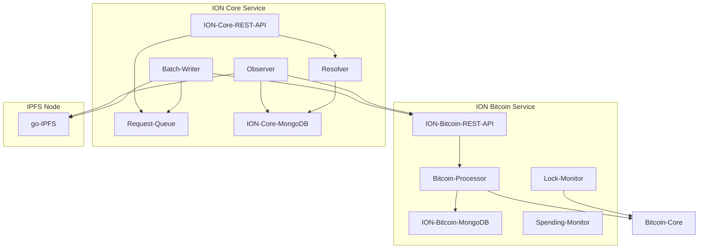

# ION Design Document
| | |
|-|-|
|Authors| Henry Tsai |
|Revision| 2022-04-04 |

The main value-proposition of ION is its ability to batch tens of thousands of DID/DPKI operations in a single Bitcoin transaction, thereby drastically increase throughput capacity of the network.

## Core Concepts
### Operations
Every ION DID has a state that is represented as a _DID Document_ when resolved. The owner can perform the following _operations_ to change the DID state:
- Create
- Update

  Used to update the DID state. e.g. change service endpoints or application-layer keys.
- Recover

  A recovery is used to reset the DID to the new intended state. All state changes due to prior update operations will be overwritten.

- Deactivate

  Deactivation is irreversible. Once a DID is deactivated, the DID will not resolve to a DID Document.

### Transactions
- An ION transaction references up to 10,000 ION [operations](#operations).
- An ION transaction is a Bitcoin transaction with ION specific metadata written as an `OP_RETURN` output.
- The ION specific metadata written in each transaction on bitcoin is of the format:

  `ion:<operation_count>.<ipfs_cid>`

  `operation_count`: The number of operations batched in the transaction. An ION node will only accept create, recover & deactivate operations as a grouping as long as their total count is less or equal to the declared number. The remaining available count is then used to check against the update operations and be accepted or rejected as a grouping.

  `ipfs_cid`: The IPFS CID of the _Core Index File_ that contains and references the data regarding all the ION operations batched in this transaction.

### Update & Recovery Keys
- An update key is used to perform an _update_ operation.
- A recovery key is used to perform a _recover_ or _deactivate_ operation.
- NEVER handout your recovery key.
- Every time an _update_ or a _recover_ operation is performed, the corresponding update or recovery key is required to be regenerated. More detail can be found in [Commit-Reveal Scheme](#commit-reveal-scheme).
- ION currently supports only SECP256K1 for update and recovery key.

### Commit-Reveal Scheme
Given the permissionless nature of ION, in order for each ION node to filter out invalid operations pertains to a DID during resolution, a hash-based commit-reveal is used:

- Every ION operation must declare (aka. commit) the hash of a secret value so that only if the right secret value (aka. reveal) is given in the subsequent operation, would the operation be considered.

- This scheme allows resolution logic to filter out invalid operations with a simple hash check without needing to perform signature validation.

- Since a new secret value is required to be generated kept for every operation, ION made the design choice of deriving the secret value directly from the update and recovery key, so that wallet implementor do not need to keep yet another two secret strings (one for update operations, the other for recover or deactivate operation).

- The precise specification on commit-reveal value generation can be found in the [Sidetree spec](https://identity.foundation/sidetree/spec/#public-key-commitment-scheme).

### DID Resolution

- The computation (resolution) of a DID's state is done by sequentially applying changes in the logical operation chain formed by the [commit-reveal scheme](#commit-reveal-scheme) .

- The operations in the logical operation chain does not have to follow chronological order. As in, a succeeding/child operation can be anchored on the blockchain before its preceding/parent operation. This behavior allows for rapid DID updates, albeit expected to be uncommon.

- If two operations with the same reveal-value and valid signatures are observed, the operation anchored earlier is chosen.

### Proof-of-Fee
In order to avoid spammers writing the maximum possible batch size for every single ION transaction, a proof-of-work based algorithm was originally considered. Eventually an algorithm that enforces a minimum transaction fee per-operation was chosen, aka _proof-of-fee_. 

- This per-operation transaction fee is based on the normalized Bitcoin transaction fee at the time of anchoring calculated from a look-back period of `100` blocks (`feeLookBackWindowInBlocks` parameter in versioned ION Bitcoin config).

- The Bitcoin transaction fee normalization algorithm can be found in `NormalizedFeeCalculator.calculateNormalizedFee()` in code.

- The per-operation fee is a fraction of the normalized Bitcoin transaction fee. This is determined by the _normalized transaction fee to per operation fee multiplier_ (`normalizedFeeToPerOperationFeeMultiplier` parameter in versioned ION Core config). This value is currently set to `0.001` (or `1/1000`th), which means that the ION node allows you to batch 1000 operations at the same estimated cost of one bitcoin transaction.


### Transaction & Operation Throttling
To prevent ION transactions from overloading the capacity of Bitcoin network, an throttling algorithm is implemented such that only a finite number of ION transactions and operations per block will be accepted by ION.

- The maximum allowed ION transactions per block is currently `300`.

- The maximum allowed ION operations per block is currently `600,000`, this equates to `60` ION transactions if all transactions are written with maximum batch size.

- ION will only accept at most `1` ION transaction per writer (Bitcoin address). In the case that multiple transactions were written by the same block, the transaction with lowest index in the block will be kept for selection/throttling, the rest is discarded.

- Transactions are sorted and selected by highest fee paid. If fee paid is the same between multiple transactions, lower indexed transaction is selected first.

- The algorithm implementation can be found in `TransactionSelector` class in code.


### Value Locking
In addition to [proof-of-fee](#proof-of-fee), value locking is introduced to further prevent spam. In essence, you need to be willing to set aside some money for about a month in order to write bigger batches or operations.

- Some bitcoins need to be _locked_ for `4500` blocks using a [Bitcoin time locked transaction](https://github.com/bitcoin/bips/blob/master/bip-0068.mediawiki) prior to writing ION transaction containing more than `100` operations.

- Bitcoin's relative time lock is used for value locking.

- The larger the batch, the more bitcoins need to be locked.

- The writer can write transactions with batch size that the value lock allows during the time lock window.

- The writer ID is the public key hash of the Bitcoin address that holds the bitcoins being spent.

- The writer ID must match the lock owner, where the owner is the public key hash of the bitcoin address receiver of the locked amount upon expiry. (See `resolveLockIdentifierAndThrowOnError()` in code). Note that owner of the lock is the receiver of the bitcoins, not the sender, since logically, it is the receiver's bitcoins that are locked once the time lock transaction is written.

- Both transaction hash and the value lock redeem script is written as the "value lock ID" in the IPFS Core Index file for value lock verification. However technically only transaction hash is needed. The value lock redeem script is there only due to the original implementation using absolute time lock, this part of the code was not removed when we switched to relative time lock.

- The allowed batch size is calculated based on the block the time lock is written in, it remains constant throughout the lock window.


The formula to calculate the required lock amount can be calculated using:

```
requiredLockedBtc = numberOfOpsPerTransactionDesired x estimatedNormalizedFee x normalizedFeeToPerOperationFeeMultiplier x valueTimeLockAmountMultiplier
```

where the following are constants:

```
normalizedFeeToPerOperationFeeMultiplier = 0.001
valueTimeLockAmountMultiplier = 60000
```


#### Value Locking Example
For instance, if you would like to write batches of 1000-operation transactions, substituting constant values and estimated normalized fee of `0.000011` you'll get:

```
1000 x 0.000011 x 0.001 x 60000 = 0.66 BTC
```

This means you will need to lock 0.66 BTC in order for transactions of 1000 operations to be accepted by ION.


### Long-Form DID
- `did:ion:<did-suffix>:<initial-state>`

- The `did-suffix` is derived from `initial-state`.

- Long-Form DIDs MUST be resolved by an ION node in case that the DID state has changed from the initial-state.

- Intended for immediate use upon generation of an ION DID to overcome the delay in anchoring on Bitcoin blockchain.

- The delay in anchoring could be intentional or technical.

- Explained in detail in [Sidetree spec](https://identity.foundation/sidetree/spec/#long-form-did-uris).

### Late Publishing
Late publishing is the act of:
1. A DID owner (or the valid key holder) anchoring two or more operations with the same [reveal-value](#commit-reveal-scheme) on the blockchain.
1. Intentionally withhold the layer-2 data for the operation(s) with an earlier anchor time.
1. Publishes the withheld layer-2 data at a later time.

Observe the fork of the operation chain and the switch from the operation with the later anchor time being chosen by resolution logic to the operation with the earlier anchor time upon the late-publish.

- Transactions with missing layer-2 data are called _unresolvable transactions_.
- Unresolvable transactions are retried for reprocessing with an exponential back-off on each ION node.
- Late publishing is an uninteresting attack if done by DID owner.
- In a custodial setting, the malicious custodian can prepare and perform a late publish to seize control of a DID.
  - As a rule-of-thumb, NEVER hand the recovery key to anyone, because anyone with your recovery key can prepare and perform a late-publish.
  - Assuming recovery key is kept private as intended, it is safe to hand the update key to a custodian.

## Implementation Architecture


## ION Core Service
### Observer
- Reads Bitcoin transactions and processes ION transactions.
- Deferred processing operations until resolution time.

### Batch Writer
- Writes ION transactions to Bitcoin network.

- Gets fee and lock information from ION Bitcoin service to decide how many operations can be written in a transaction.

- The Bitcoin minors at any given time may demand more or less transaction fee the the total per-operation fee required by ION. The batch writer will spend the lager amount of the two to ensure reliable anchoring of the ION transaction.

- Waits for confirmation.

### Rest APIs
- For DID resolution and posting operation requests.

### Version Manager
- Loads versioned components under the `versions` folder based on block height.

### Document Composer
- Transforms internal ION DID state to a standardized DID Document.

### Download Manager
- Handles concurrent download of IPFS files.

### Block Re-Organization Handling
- Part of Observer.

## ION Bitcoin Service
### Bitcoin Processor
- Main component.
- Handles inbound requests from ION Core Service.

### Fast initialization
- Reads Bitcoin block files directly for faster parsing of ION transactions.
- Process the block files in reverse block height order.

### Spending monitor
- Monitors spending, prevents write when specified limit is met.

### Lock monitor
- Responsible for monitoring the value lock such that the ION Core Batch Writer is able to write ION transactions with the desired batch size.

### IBitcoinWallet
- An interface that allows plugin of different Bitcoin wallet implementation.
- Default implementation uses Bitcoin Core.

## IPFS
- ION Core interfaces with IPFS through go-IPFS RPC API.
